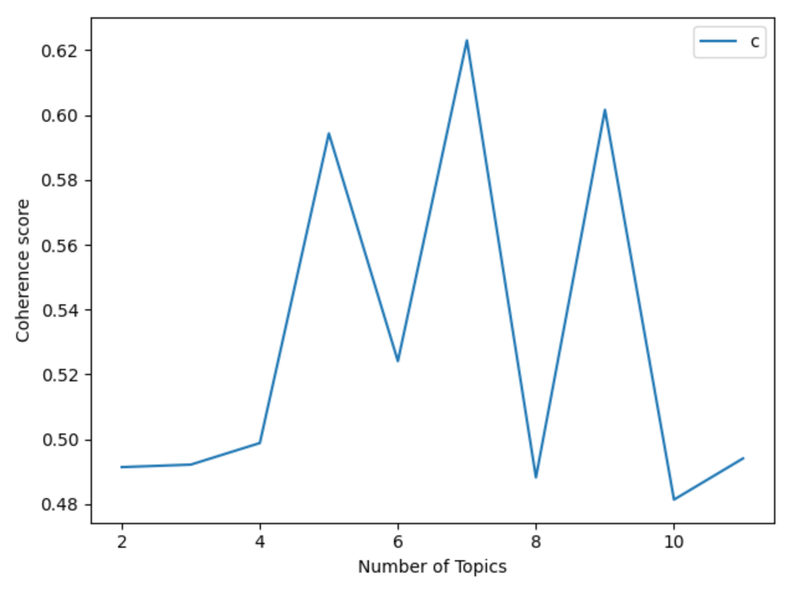

# LSA on English texts
From the tutorial https://www.datacamp.com/community/tutorials/discovering-hidden-topics-python

That implementation requires You to install stopwords for nltk.

In python console:
```
>>> import nltk
>>> nltk.download('stopwords')
```

Result graph:
